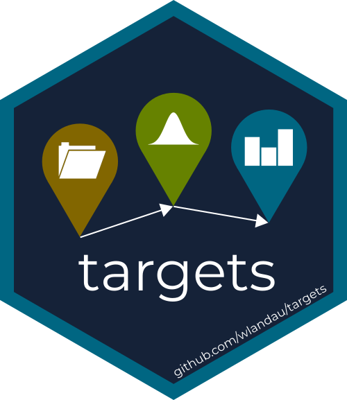
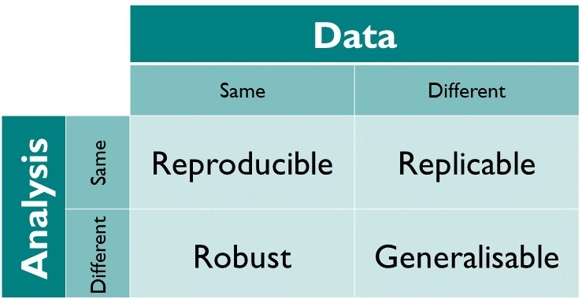
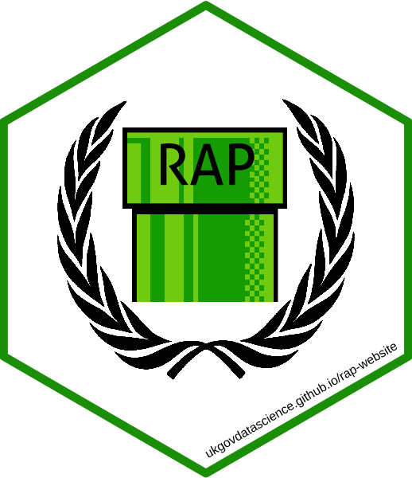
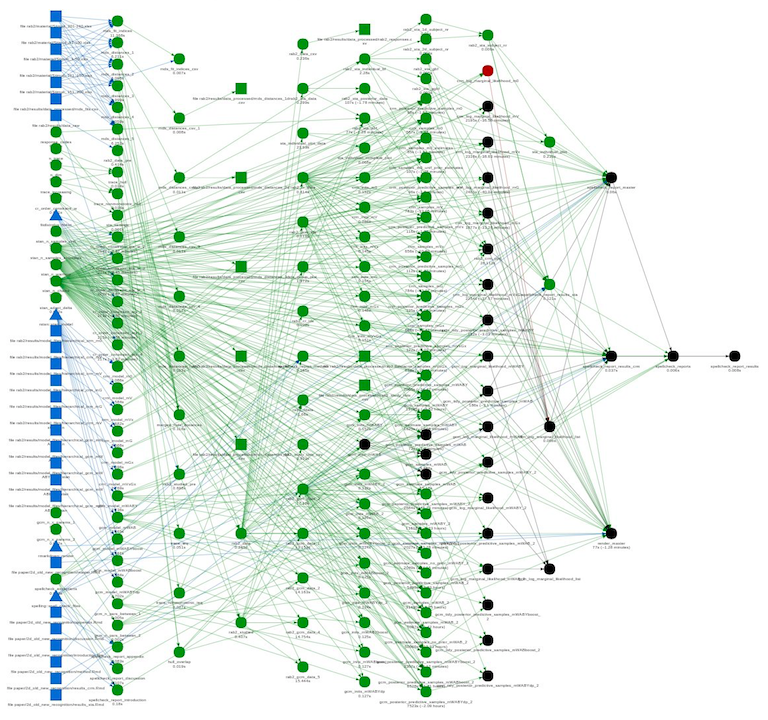
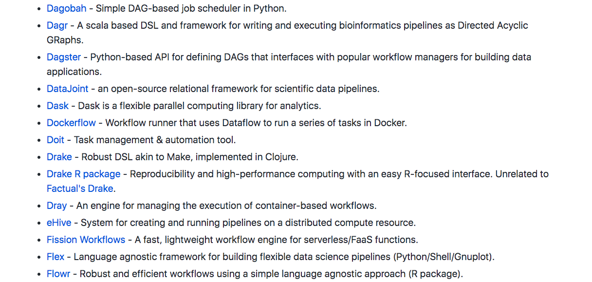

class: center, middle, inverse

```{r xaringanextra, echo=FALSE}
xaringanExtra::use_tile_view()
xaringanExtra::use_fit_screen()
```



# Hit your reproducibility {targets}

UK Government Data Science Festival, 2020-09-30

Matt Dray, Cabinet Office

???
* I have an entomology MSc and a PhD on ecosystem processes under environmental change (watching leaves rot, if you want to get technical)
* Over five years as a government analyst, much of it spent encouraging a switch to R from Excel-led processes

---
class: middle, inverse

# Reproducevangelism

???
* I don't want to condescend or dictate, I want to build from the general principle of 'reproducible is good'
* So let's define 'reproducibility'
* Very important in scientific fields given the reproducibility crisis

---
class: middle, center



From [The Turing Way](https://the-turing-way.netlify.com/introduction/introduction) by The Alan Turing Institute

???
* We could get into a heated debate about the definition
* The book is a great free resource for reproduciblity in general
* I think we care about both (i) recreating outputs and (ii) updating with fresh data
* I'm going to refer to this top row as reproducibility throughout

---
class: middle

Can I recreate what you did:

* from scratch?
* on a different machine?
* in the future?
* without you present?

???
* Do I have all the code, files and documentation?
* Can I do it on another OS with dependencies missing?
* Will the code still work next year, or will dependency chenages break it?
* Did you document it well enough? Is everything stored somewhere remotely?

---
class: middle

So, ultimately:

* can I trust your outputs?
* can _you_ trust your outputs?

???
* Working in a reproducible way benefits you, with the excellent by-product of also helping others

---
class: middle

Today's focus:

1. Make _workflows_ reproducible
1. Try {targets}

???
* We could talk about this all day, but I'm focusing on one particular thing today
* If these both mean nothing to you, then great
* If you know about workflow reproducibility, maybe you haven't considered {targets}
* If you do both these things, then you should be here talking instead of me

---
class: heading-slide, middle, inverse

# 1. Make workflows reproducible

???
* I'm referring to analysis 'workflows', but you might say 'pipelines'
* As in you read, wrangle, model, plot and report data in some fashion
* The process of turning inputs to outputs
* This talk assumes that you do this in R, but ideas are transferable

---
class: middle

R has [many reproducibility tools](https://annakrystalli.me/talks/r-in-repro-research-dc.html#1), like:

* [RStudio Projects](https://swcarpentry.github.io/r-novice-gapminder/02-project-intro/) to keep everything together
* [R Markdown](https://rmarkdown.rstudio.com/) for reproducible docs
* [packages](https://www.hvitfeldt.me/blog/usethis-workflow-for-package-development/) for reusable functions
* [{here}](https://github.com/jennybc/here_here) for relative filepaths
* [{renv}](https://rstudio.github.io/renv/articles/renv.html) for dependency management

???
* Some general tools, but also packages for very specific things like filepath management
* Of course, there's agnostic tools like Git and Docker too

---
class: middle, center

[Reproducible Analytical Pipelines](https://ukgovdatascience.github.io/rap-website/)



An example: [Can {drake} RAP?](https://www.rostrum.blog/2019/07/23/can-drake-rap/)

???
* In government we recognise the benefits of reproducible analysis and publications
* Literally this is a badge of pride in government
* We want to make sure the whole end-to-end process from data to publication is repeatable
* We want to build trust, but also make it easier to update publications as new data emerges
* I wrote a thing about how {drake} might be useful for RAP in government
* There are similar tools in other languages

---
class: middle

What about your analytical _workflow_ itself?

How do you keep track of function, file and object relationships?

???
* Have you considered this before?
* You might be asking why you might even do this -- is it really a big deal?

---
class: middle

What if:

* you haven't recorded the steps?
* the interdependencies become complex?
* some steps are computationally intensive?
* something changes?

???
* You might be thinking 'no, what's the point?'
* What impact does a change to file 'A' have?
* What if it's time intensive?
* Do you re-run everything from scratch if there's a change?
* Maybe this isn't a big deal for a small analysis, but things can get out of hand quickly

---
class: middle, center

You can't remember this



???
* Here's a real analysis
* All of the files, functions and objects that result in one final output on the right
* The spaghetti is all the relationships
* How could you possibly remember the exact things to re-run if something changes?

---
class: middle

Maybe:

Maybe  `01-read.R`, `02-wrangle.R`, etc?

???
* This doesn't scale well -- might be okay for smaller projects
* Implies the analysis is perfectly sequential -- but some objects from file `01` might be applied in `03` rather than `02`
* You'll still have to re-run from scratch sometimes

---

class: middle, center

Let a workflow manager handle it



`r icon::fa('github')` [pditommaso/awesome-pipeline](https://github.com/pditommaso/awesome-pipeline)

???
* There are many workflow managers -- some general, some language-specific
* The one that most people might be familiar with is Make (capital 'M')
* It's language agnostic, but has some limitations -- it operates on files, for example and requires you to learn how to use Make
* This is a powerful thought technology

---
class: heading-slide, middle, inverse

# 2. Try {targets}

???
* If there's so many managers then why {targets}?

---
class: middle, center


[{targets}](https://wlandau.github.io/targets-manual/) by [Will Landau](https://wlandau.github.io/)

???
* {targets}: the R package built by Will Landau for managing workflows and making your analysis pipeline more reproducible
* What the heck is {drake}?

---
class: middle, center


Supersedes [{drake}](https://books.ropensci.org/drake/) by [Will Landau](https://wlandau.github.io/)

???
* "Community feedback have exposed major user-side limitations regarding data management, collaboration, and parallel efficiency."
* "Solutions in drake itself would make the package incompatible with existing projects that use it, and the internal architecture is too copious, elaborate, and mature for such extreme refactoring."
* "The targets package borrows from past learnings, user suggestions, discussions, complaints, success stories, and feature requests, and it improves the user experience in ways that will never be possible in drake."

---
class: middle

{targets} is compelling because it's:

* R-specific
* free
* under active development
* got great documentation and examples
* ~~part of [rOpenSci](https://ropensci.org/)~~

???
* For {targets}, targets are any arbitrary values in memory (they must be files in Make)
* Proprietary software might be okay when working alone or with specific collaborators who also have the tool, but what about the wider world?
* Will is active at responding to issues and developing new things (i.e. deciding that {targets} was the right response to the development and learning from {drake}, in particular)
* Will has provided a lot of materials to explain the use of {targets}, as well as learning materials like a Shiny app and installable example projects (I've listed these on a slide at the end)
* {drake} was part of rOpenSci for 'carefully vetted, staff- and community-contributed R software tools that lower barriers to working with scientific data sources and data that support research applications on the web' - requires peer review

---
class: middle

At its simplest:

1. Make a `tar_pipeline()`
1. Run `tar_make()`
1. Change stuff
1. Go to 2

???
* The smallest amount of things you need to do is run two functions
* You create a 'plan' object that' contains the functions, objects and data in your's a bit like a recipe for generating your analysis
* Then you run `make()` on that object to run the steps and 'bake your cake'
* Let's go through a simple, arbitrary, trivial example
* We're not going to think too hard about folder structure in this example
* In fact, this workflow will be running from within this {xaringan} (RMarkdown slides)

---
class: middle, inverse

# Small demo


???
* Using the built-in `beaver1` and `beaver2` datasets
* You can see something similar in the walkthrough chapter of the {targets} user manual
* This example is run entirely within this {xaringan} presentation, giving you a flavour of its versatility

---
class: middle

The process:

1. `tar_script()` creates `_targets.R`
1. Add `tar_targets()`
1. Check `tar_manifest()`
1. Execute with `tar_make()`
1. `tar_visnetwork()` to visualise
1. Change stuff, check `tar_outdated()`
1. Go to 3

---
class: inverse, middle

# What now?

???
* We talked about reproducibility, about workflow managers, about {targets}
* What do I think you should do now?

---
class: middle

Check out official {targets} materials:

* the [site](https://wlandau.github.io/targets/) and [source](https://github.com/ropensci/targets)
* the [{targets} R package user manual](https://wlandau.github.io/targets-manual/index.html)
* [minimal example](https://github.com/wlandau/targets-minimal) (can be run in RStudio Cloud)
* [targetsketch](https://wlandau.shinyapps.io/targetsketch/): a Shiny app for learning {targets} and setup new projects

More available from [the {targets} README](https://github.com/wlandau/targets/blob/master/README.md).

---
class: middle

Revisit today's materials:

* [matt-dray.github.io/targets-dsfest/](https://matt-dray.github.io/drake-bioinformatics/#1)
* [github.com/matt-dray/targets-dsfest](https://github.com/matt-dray/drake-bioinformatics/)
* run today's example in Binder 

???
* Slides and source on GitHub, along with a single script file of the code used in the presentation
* Binder is a service that lets you launch a Notebook or RStudio instance in the cloud with data and code that you provide

---
class: inverse, middle, center


# Reproducible workflows with {targets}

`r icon::fa('twitter')` [mattdray](https://twitter.com/mattdray)
`r icon::fa('github')` [matt-dray](https://github.com/matt-dray)
`r icon::fa('globe')` [rostrum.blog](https://www.rostrum.blog/) 

???
* I hope I've convinced you to consider a workflow manager
* And hopefully to take a look at {targets} as your tool of choice for R

---
class: middle

Sources

* {targets} [hex logo](https://github.com/wlandau/targets/blob/master/man/figures/logo.png)
* {drake} [hex logo](https://camo.githubusercontent.com/44749362ca36c9e3295f2bcf18975d811564c121/68747470733a2f2f646f63732e726f70656e7363692e6f72672f6472616b652f7265666572656e63652f666967757265732f6c6f676f2e737667)
* {drake} hairball by [Frederik Aust](https://twitter.com/FrederikAust/status/1205103780938833921?s=20)
* _Castor canadensis_ from [PhyloPic](http://phylopic.org/image/b3dd721e-6084-4413-8300-44e10d8fd3ca/)
