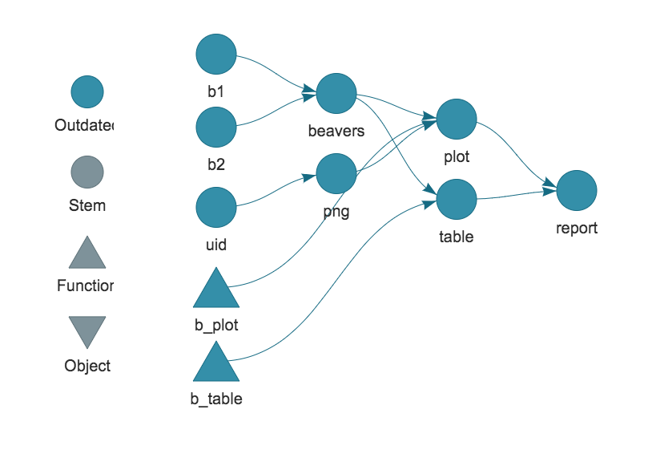
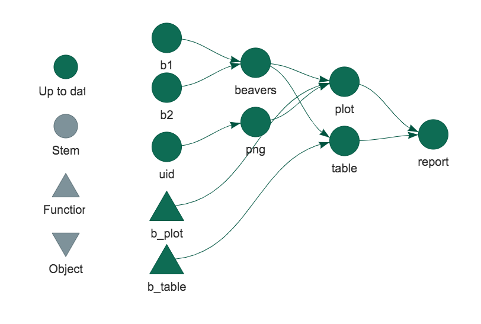
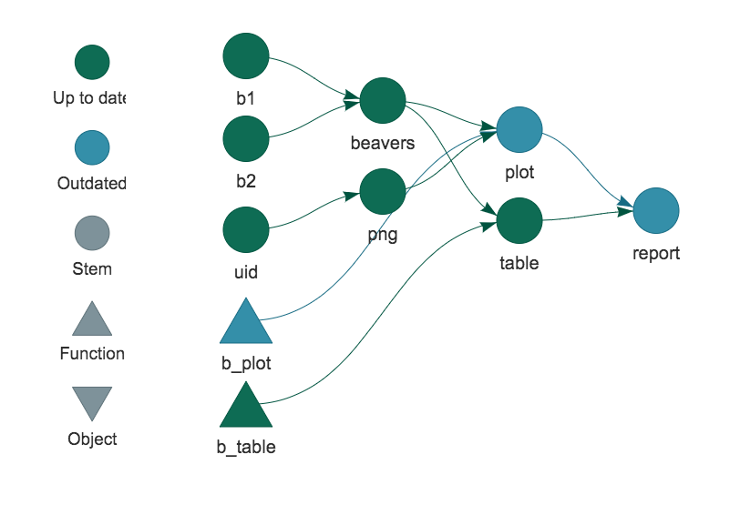

class: middle, inverse

```{r xaringanextra, echo=FALSE}
xaringanExtra::use_tile_view()
xaringanExtra::use_fit_screen()
htmltools::tagList(
  xaringanExtra::use_clipboard(
    button_text = "<i class=\"fa fa-clipboard\"></i>",
    success_text = "<i class=\"fa fa-check\" style=\"color: #90BE6D\"></i>",
  ),
  rmarkdown::html_dependency_font_awesome()
)
xaringanExtra::style_share_again(
  share_buttons = c("twitter", "linkedin", "facebook")
)
```


# Hit your reproducibility {targets}

UK Gov Data Science Festival, 2020-09-29

`r icon::fa('twitter')` [mattdray](https://twitter.com/mattdray)
`r icon::fa('github')` [matt-dray](https://github.com/matt-dray)
`r icon::fa('globe')` [rostrum.blog](https://www.rostrum.blog/) 

???
* Work in CSPS in CO
* Find me on the Slack as mattdray_co
* You can find me on the web

---
class: middle

Revisit materials:

* [these slides](https://matt-dray.github.io/drake-bioinformatics/#1)
* [source](https://github.com/matt-dray/drake-bioinformatics/) including demo code
* [blog post](https://www.rostrum.blog/2020/09/27/targets-dsfest/)
* [{drake} talk](https://www.rostrum.blog/2020/01/31/reprobioinformatics/) and [blog post](https://www.rostrum.blog/2019/07/23/can-drake-rap/)

???
* In case you fall asleep, youc an revisit all these materials
* Slides and source on GitHub
* Short blog post too
* I've written about the predecessor to {targets} in another post/presentation (I'll mention that later)

---
class: middle, inverse

# Reproducevangelism

???
* Let's get on the same page
* What is reproducibility?
* Why is it good?

---
class: middle, center


From [The Turing Way](https://the-turing-way.netlify.com/introduction/introduction) by The Alan Turing Institute

???
* The book is a great free resource for reproducibility in general
* I think we care about both (i) recreating outputs and (ii) updating with fresh data
* I'm going to refer to this top row as reproducibility throughout

---
class: middle, center


[Reproducible Analytical Pipelines](https://dataingovernment.blog.gov.uk/2017/03/27/reproducible-analytical-pipeline/)

???
* In government we recognise the benefits of reproducible analysis and publications
* We want to make sure the whole end-to-end process from data to publication is repeatable
* We want to build trust, but also make it easier to update publications as new data emerges

---
class: middle

Can I recreate what you did:

* from scratch?
* on a different machine?
* in the future?
* without you present?

???
* Do I have all the code, files and documentation?
* Can I do it on another OS with dependencies missing?
* Will the code still work next year, or will dependency changes break it?
* Did you document it well enough? Is everything stored somewhere remotely?

---
class: middle

R has [many reproducibility tools](https://annakrystalli.me/talks/r-in-repro-research-dc.html#1), like:

* [RStudio Projects](https://swcarpentry.github.io/r-novice-gapminder/02-project-intro/) to keep everything together
* [R Markdown](https://rmarkdown.rstudio.com/) for reproducible docs
* [packages](https://www.hvitfeldt.me/blog/usethis-workflow-for-package-development/) for reusable functions
* [{here}](https://github.com/jennybc/here_here) for relative filepaths
* [{renv}](https://rstudio.github.io/renv/articles/renv.html) for dependency management

???
* I'll be focusing on R today, but other software has these types of tools
* Of course, there's language-agnostic tools like Git and Docker too

---
class: middle

Today's focus:

1. Make workflows reproducible
1. Try {targets}

???
* I want to talk about making workflows (or pipelines) reproducible
* I want to tell you about a package in R for doing it

---
class: heading-slide, middle, inverse

# 1. Make workflows reproducible

???
* I'm referring to analysis 'workflows', but you might say 'pipelines'
* As in you read, wrangle, model, plot and report data in some fashion
* The process of turning inputs to outputs
* The ideas here should be transferable
* This is a powerful thought technology

---
class: middle

What about the relationships between functions, files and outputs?

Is your analytical pipeline reproducible?

???
* Have you considered this before?
* You might be asking why you might even do this -- is it really a big deal?

---
class: middle

What if:

* you haven't recorded the steps?
* the interdependencies become complex?
* some steps are computationally intensive?
* something changes?

???
* You might be thinking 'no, what's the point?'
* What impact does a change to file 'A' have?
* What if it's time intensive?
* Do you re-run everything from scratch if there's a change?
* Maybe this isn't a big deal for a small analysis, but things can get out of hand quickly

---
class: middle, center

You can't remember this


???
* Here's a real analysis
* All of the files, functions and objects that result in one final output on the right
* The spaghetti is all the relationships
* How could you possibly remember the exact things to re-run if something changes?
* 01_file.R, 02_file.R, etc, doesn't really scale

---

class: middle, center

Let a workflow manager handle it


`r icon::fa('github')` [pditommaso/awesome-pipeline](https://github.com/pditommaso/awesome-pipeline)

???
* There are many workflow managers -- some general, some language-specific
* The one that most people might be familiar with is Make (capital 'M')
* It's language agnostic, but has some limitations -- it operates on files, for example and requires you to learn how to use Make
* Luigi and Airflow are alternatives for Python

---
class: heading-slide, middle, inverse

# 2. Try {targets}

???
* In this section: if there's so many managers then why {targets}?

---
class: middle, center


[{targets}](https://wlandau.github.io/targets/) by [Will Landau](https://wlandau.github.io/)

???
* {targets}: the R package built by Will Landau for managing workflows and making your analysis pipeline more reproducible
* Disclaimer: I haven't spent a lot of time with this package and it's quite new

---
class: middle

From [the manual](https://wlandau.github.io/targets-manual/), it:

* learns how your pipeline fits together
* skips costly runtime
* runs only the necessary computation
* supports parallel computing
* abstracts files as R objects
* evidences that results match code and data

???
* Identifies and remembers the relationships for you
* Helps speed things up
* Is R-specific
* Gives a record that the output is the result of the underlying inputs


---
class: middle

It also has excellent docs:

* the [site](https://wlandau.github.io/targets/) and [source](https://github.com/ropensci/targets)
* the [{targets} R package user manual](https://wlandau.github.io/targets-manual/index.html)
* [minimal example](https://github.com/wlandau/targets-minimal) (can be run in RStudio Cloud)
* [targetsketch](https://wlandau.shinyapps.io/targetsketch/): a Shiny app for learning {targets} and setup new projects

More resources in [the {targets} README](https://github.com/wlandau/targets/blob/master/README.md).

---
class: middle, center

Supersedes [{drake}](https://books.ropensci.org/drake/) by [Will Landau](https://wlandau.github.io/)


>...major user-side limitations regarding data management, collaboration, and parallel efficiency

???
* This sounds suspiciously similar to {drake}.
* "Community feedback have exposed major user-side limitations regarding data management, collaboration, and parallel efficiency."
* "Solutions in drake itself would make the package incompatible with existing projects that use it, and the internal architecture is too copious, elaborate, and mature for such extreme refactoring."
* "The targets package borrows from past learnings, user suggestions, discussions, complaints, success stories, and feature requests, and it improves the user experience in ways that will never be possible in drake."

---
class: middle

At its simplest:

1. Write a pipeline script
1. Execute the script
1. Change stuff
1. Go to 2

???
* This is very basically what you do with {targets}
* It requires a slight change in thinking
* Let's go through a simple, arbitrary, trivial example

---
class: middle, center, inverse


# Contrived, simple demo

???
* Using the built-in `beaver1` and `beaver2` datasets
* You can see something similar in the walkthrough chapter of the {targets} user manual

---
class: middle

The goal is a {targets} pipeline that:

* creates a chart
* creates a table
* renders them in an R Markdown report

Then we'll change something and re-run it.

---
class: middle

Generate [`_targets.R`](https://github.com/matt-dray/targets-dsfest/blob/master/_targets.R) in your working directory

```{r eval=FALSE}
tar_script()
```

???
* You create a special file that {targets} will recognise as containing a pipeline
* You can create this yourself, or use this handy function to generate it with a template inside

---
class: middle

Set up functions and options in `_targets.R`

```{r eval=FALSE}
tar_option_set(
  packages = c(
    "targets", "tarchetypes", "knitr",
    "dplyr", "ggplot2", "rphylopic",
  )
)
```
```{r eval=FALSE}
b_plot <- function(data, image) {
  ggplot(data, aes(id, temp)) +
    geom_boxplot() +
    labs(title = "Weasel temperatures") +
    add_phylopic(image)
}
```


???
* You can add options in there, including your package calls
* Also add your bespoke functions
* Here's one (`b_plot`) for making a plot, there's another for making a summary table

---
class: middle

Set up pipeline in `_targets.R`

```{r eval=FALSE}
targets <- list(
  tar_target(b1, mutate(beaver1, id = "A")),
  tar_target(b2, mutate(beaver2, id = "B")),
  tar_target(beavers, bind_rows(b1, b2)),
  tar_target(uid, "be8670c2-a5bd-4b44-88e8-92f8b0c7f4c6"),
  tar_target(png, image_data(uid, size = "512")[[1]]),
  tar_target(plot, b_plot(beavers, png)),  #<<
  tar_target(table, b_table(beavers)),
  tarchetypes::tar_render(report, "report-beavers.Rmd")  #<<
)

tar_pipeline(targets)  #<<
```

???
* Then it's a case of making a `tar_pipeline()`, which {targets} uses to 'remember' the relationships between objects
* Mark objects as targets with `tar_target()`
* `tarchetypes::tar_render()` is a special `tar_target()` case to account for rendering Rmd (so you don't have to write an argument-heavy `tar_target()` call)

---
class: middle

View your targets

```{r eval=FALSE}
tar_manifest(fields = "command")
```

```
  name    command                                                                                                 
  <chr>   <chr>                                                                                                   
1 uid     "\"be8670c2-a5bd-4b44-88e8-92f8b0c7f4c6\""                                                              
2 report  "tarchetypes::tar_render_run(path = \"beavers-report.Rmd\",  \\n     args = list(input = \"beavers-repo…
3 beavers "bind_rows(b1, b2)"                                                                                     
4 table   "b_table(beavers)"                                                                                      
5 plot    "b_plot(beavers, png)"                                                                                  
6 b1      "mutate(beaver1, id = \"A\")"                                                                           
7 b2      "mutate(beaver2, id = \"B\")"                                                                           
8 png     "image_data(uid, size = \"512\")[[1]]"                                                                  
```

???
* This gives you a dataframe of the steps of the analysis
* You can check this to see if it's what you expect

---
class: middle

```{r eval=FALSE}
tar_visnetwork()
```



???
* There's a handy function for viewing a graph representation of the files, objects, etc
* the colour key indicates these targets are 'all out of date' because you haven't executed your pipeline yet

---
class: middle

Execute the pipeline

```{r eval=FALSE}
tar_make()
```

```
● run target uid
● run target b1
● run target b2
● run target png
● run target beavers
● run target plot
● run target table
● run target report
```

???
* Now we execute the pipeline
* {targets} knows what order things need to be run, based on the content of the manifest
* This prints to the console a step by step of what's being run

---
class: middle


This created [a `_targets/` cache](https://github.com/matt-dray/targets-dsfest/tree/master/_targets)

This is like a 'memory' for {targets}

`tar_load()` and `tar_read()` to fetch objects

???
* In executing the pipeline, the objects get stored in a cache
* Also the metadata for each of those objects is stored
* You can pull out the objects as you please
* You can call for these objects in your Rmd file with `tar_load()` and `tar_read()`

---
class: middle

```{r eval=FALSE}
tar_visnetwork()
```



???
* So when we re-visualise, we can see the colours have changed from being 'outdated' to being 'up to date'


---
class: middle

The [rendered R Markdown](https://matt-dray.github.io/targets-dsfest/report-beavers-mistake.html)

```{r report-mistake, echo=FALSE}
knitr::include_url(
  "https://matt-dray.github.io/targets-dsfest/report-beavers-mistake.html",
  height = 440
)
```

???
* Here's what the report output looks like
* Do you notice a problem?

---
class: middle

Whoops...

<span style="background-color: #FF0000">-</span> `labs(title = "Weasel temperatures")`

<span style="background-color: #00FF00">\+</span> `labs(title = "Beaver temperatures")`

???
* The chart title is wrong!
* Go into the function in the `_targets.R` file and correct it
* Now we have some targets downstream of this function that will be out of date

---
class: middle

Check what has become outdated as a result

```{r eval=FALSE}
tar_outdated()
```

```
[1] "report" "plot"  
```

???
* We changed the function that creates the plot
* The plot goes into the report
* So the report and plot targets are out of date
* {targets} will use this knowledge to re-run only these files when we re-execute

---
class: middle

```{r eval=FALSE}
tar_visnetwork()
```



???
* The graph now shows that the function and the two targets are outdated

---
class: middle

Only outdated targets are re-run

```{r eval=FALSE}
tar_make()
```

```
✓ skip target uid
✓ skip target b1
✓ skip target b2
✓ skip target png
✓ skip target beavers
● run target plot
✓ skip target table
● run target report
```

???
* When we re-execute the pipeline, {targets} only re-runs the plot creation and Rmd render
* It skips the other targets; it doesn't re-run them
* They remain unchanged in the cache

---
class: middle

```{r eval=FALSE}
tar_visnetwork()
```


???
( So the graph shows everything is up to date again)

---
class: middle

The [final product](https://matt-dray.github.io/targets-dsfest/report-beavers.html)

```{r report-fix, echo=FALSE}
knitr::include_url(
  "https://matt-dray.github.io/targets-dsfest/report-beavers.html",
  height = 440
)
```

???
* And here's the corrected output

---
class: middle

To recap:

1. `tar_script()` creates `_targets.R`
1. Add `tar_targets()`
1. Check `tar_manifest()`
1. `tar_visnetwork()` to visualise
1. Execute with `tar_make()`
1. Change stuff, check `tar_outdated()`
1. Go to 4

???
* This is a rough recap with functions named

---
class: middle

And again, at its simplest:

1. Write a pipeline script
1. Execute the script
1. Change stuff
1. Go to 2

???
* Here's the high-level reminder again
* Create the pipeline, execute it, change stuff, re-execute it
* When people come back to this analysis in future, they can check that everything is up to date

---
class: inverse, middle


# Hit your reproducibility {targets}

1. Make workflows reproducible
2. Try {targets}

`r icon::fa('twitter')` [mattdray](https://twitter.com/mattdray)
`r icon::fa('github')` [matt-dray](https://github.com/matt-dray)
`r icon::fa('globe')` [rostrum.blog](https://www.rostrum.blog/) 

???
* I hope I've convinced you to consider how you can make your analytical pipeline reproducible
* And if you're an R user, hopefully to take a look at {targets} as an option

---
class: middle

Image sources:

* RAP [hex logo](https://github.com/matt-dray/stickers/blob/master/output/rap_v4_hex.png)
* {targets} [hex logo](https://github.com/wlandau/targets/blob/master/man/figures/logo.png)
* {drake} [hex logo](https://camo.githubusercontent.com/44749362ca36c9e3295f2bcf18975d811564c121/68747470733a2f2f646f63732e726f70656e7363692e6f72672f6472616b652f7265666572656e63652f666967757265732f6c6f676f2e737667)
* {drake} hairball by [Frederik Aust](https://twitter.com/FrederikAust/status/1205103780938833921?s=20)
* _Castor canadensis_ from [PhyloPic](http://phylopic.org/image/b3dd721e-6084-4413-8300-44e10d8fd3ca/)
